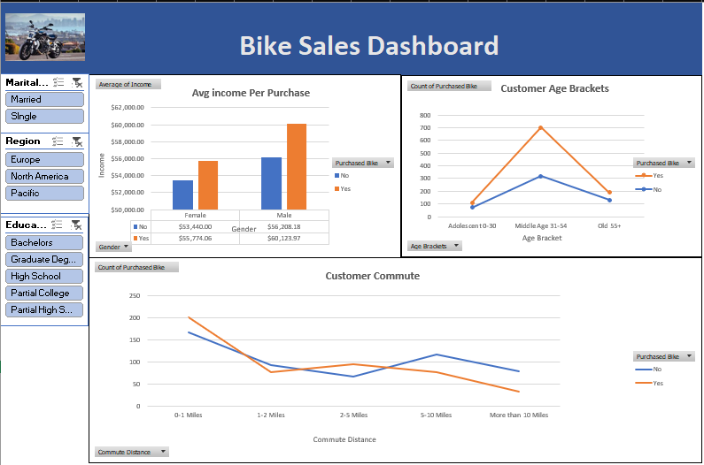

# bike-sales-customer-segmentation-analysis
# 🚲 Bike Sales Analysis: Customer Segmentation & Purchase Drivers

## 📌 Project Overview
This project analyzes customer demographics and behavioral patterns to identify key factors influencing bike purchases. The goal is to uncover high-value customer segments and provide actionable business recommendations.

---

## 🎯 Business Problem
How can a bike company increase sales by identifying high-probability customer segments based on income, age, commute distance, and lifestyle factors?

---

## 📊 Dataset
- Source: Alex The Analyst (YouTube tutorial dataset)
- Records: ~1000 customers
- Features:
  - Age
  - Income
  - Gender
  - Education
  - Occupation
  - Commute Distance
  - Region
  - Purchase Decision

---

## 🧹 Data Cleaning
- Removed duplicates
- Standardized categorical values
- Created age groups using logical conditions
- Ensured consistency across fields

---

## 📈 Analysis Performed
- Income vs Purchase behavior
- Age group segmentation
- Commute distance impact
- Regional trends
- Education & occupation influence

---

## 🔍 Key Insights

- **Income Impact**: Mid-to-high income customers show the highest likelihood of purchasing bikes  
- **Commute Distance**: Customers with 0–5 mile commutes are the most likely buyers  
- **Age Group**: Middle-aged individuals (31–54) form the primary customer base  
- **Regional Trends**: Bike purchases are higher in regions with better infrastructure  
- **Socioeconomic Factors**: Income and job stability drive purchasing decisions more than education alone  

---

## 💡 Business Recommendations

- Target working professionals in urban areas  
- Position bikes as short-distance commuting solutions  
- Offer EMI/payment plans for mid-income customers  
- Focus marketing efforts in high-performing regions  
- Partner with companies for employee-focused promotions  

---

## 📊 Dashboard

---

## 🛠 Tools Used
- Microsoft Excel  
- Pivot Tables  
- Data Cleaning Techniques  
- Data Visualization  

---

## 🚀 Future Improvements
- SQL-based analysis  
- Power BI interactive dashboard  
- Predictive modeling using Python  
